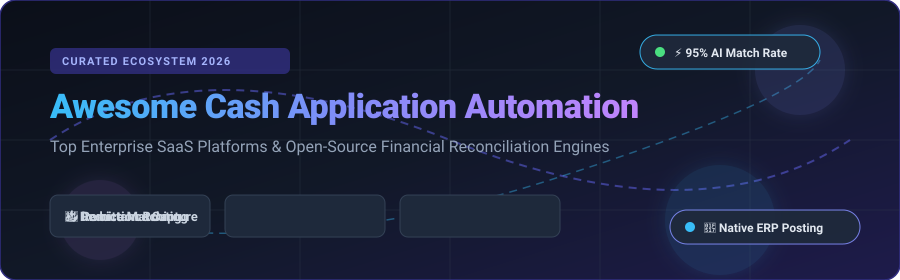

# ⚡ Awesome Cash Application Automation

  
  
  
  
  

## 📌 Ecosystem Overview & Guide

**Curated List of Enterprise SaaS Platforms & Open-Source GitHub Projects**

*Focused on Remittance Capture, Accounts Receivable (AR) Matching, Deduction Resolution, Bank Reconciliation & ERP Cash Posting.*

**Last updated: September 2026**

This repository tracks notable **SaaS platforms** and **open-source projects** for **Cash Application Automation**. These tools help enterprise and SMB finance teams automatically match incoming bank payments (ACH, Wire, Check, Lockbox, EDI) to open receivables invoices, capture complex remittance data from emails and PDFs, resolve deduction short-pays, and post reconciled cash into ERP systems (SAP, Oracle, NetSuite, Workday, Dynamics) with minimal manual effort.

---

## 📑 Table of Contents

- [🏢 Enterprise & Mid-Market SaaS Platforms](#-enterprise--mid-market-saas-platforms)
- [💻 Open-Source GitHub Projects](#-open-source-github-projects)
- [🤝 How to Contribute](#-how-to-contribute)
- [💖 Support & Sponsorship](#-support--sponsorship)
- [⚠️ Disclaimer](#-disclaimer)
- [📈 Star History](#-star-history)

---

## 🏢 Enterprise & Mid-Market SaaS Platforms

> 📊 **Sector Market Insights**: The global Accounts Receivable (AR) & Cash Application Automation software market is estimated at **$3.8 Billion – $4.5 Billion (2026)** and growing at a ~13.5% CAGR. The sector is **moderately concentrated at the enterprise level** (led by category heavyweights like BlackLine, HighRadius, and Billtrust), while remaining **fragmented in the SMB and mid-market segments** where niche payment workflow tools and ERP add-ons compete.

*Platforms sorted descending by estimated company size (Revenue / Valuation).*

| Platform | Key Features & Focus | Company Size / Valuation | Starting Pricing | Free Tier / Trial Limit |
| :--- | :--- | :--- | :--- | :--- |
| **[BlackLine Cash Application](https://www.blackline.com/)** 🚀 | Finance-led AI (Verity) payment matching, ~90% straight-through processing, unapplied cash reduction, seamless SAP/Oracle integration. | Public (NASDAQ: BL) · ~$732M/yr Rev · ~$3.8B Market Cap | ~$13,000 / year ($1,083 / month) starting tier | No free tier; custom demo request available |
| **[HighRadius](https://www.highradius.com/)** 🤖 | Market leader in AI cash application. 90–95%+ matching rates, automated remittance capture (lockbox, EDI, email, AP portals), native ERP connectors. | Private · ~$300M+/yr Rev · ~$3.1B Valuation | ~$50,000 / year ($4,166 / month) for SMB tier | No free tier; live demo request available |
| **[Billtrust](https://www.billtrust.com/)** 💳 | Order-to-Cash leader offering AI remittance capture, multi-channel payment matching, automated ERP cash posting, and exception handling. | Acquired by EQT · ~$170M+/yr Rev · ~$1.7B Valuation | ~$50,000 / year ($4,166 / month) starting tier | No free tier; enterprise demo request available |
| **[Quadient AR](https://www.quadient.com/)** 📊 | Accounts receivable automation platform offering automated cash application, collections management, and credit risk tools. | Public Parent (Euronext: QDT) · €1.09B Rev · Division ~$50M+ | ~$10,000 / year ($833 / month) mid-market plan | No free tier; live demo request available |
| **[Serrala](https://www.serrala.com/)** 💼 | Enterprise financial automation with deep SAP integration, AI-powered payment matching, and automated deduction exception routing. | Private Equity (Hg-backed) · ~$100M–$150M/yr Rev | ~$35,000 / year ($2,916 / month) enterprise base | No free tier; guided demo request available |
| **[Versapay](https://www.versapay.com/)** 🤝 | Collaborative AR platform combining remittance capture, payment processing, cash application, and buyer collaboration portals. | Private (Great Hill Partners) · ~$70M/yr Rev · ~$500M Valuation | ~$500 / month ($6,000 / year) subscription base | No free tier; interactive demo request available |
| **[Emagia](https://www.emagia.com/)** ⚡ | Autonomous Order-to-Cash platform featuring remittance capture, multi-invoice matching, and deduction management. | Private · ~$30M–$50M/yr Rev · ~$150M Valuation | ~$30,000 / year ($2,500 / month) entry module | No free tier; custom demo request available |
| **[Tesorio](https://www.tesorio.com/)** 🎯 | Cash flow & AR automation platform providing AI cash application, collections prioritization, and DSO forecasting. | Private (Series B) · ~$15M–$25M/yr Rev · ~$100M Valuation | ~$30,000 / year ($2,500 / month) base plan | No free tier; 14-day guided pilot/demo on request |
| **[Centime](https://www.centime.com/)** 💡 | Cash flow & AR management platform with cash application, collections, and automated payment reconciliation for SMBs. | Private · ~$5M–$10M/yr Rev · ~$40M Valuation | $149 / month ($1,788 / year) starting tier | 14-day free trial (with interactive product tour) |
| **[Cashbook](https://www.cashbook.com/)** 📒 | High-volume transaction matching, bank statement automated import, remittance capture, and ERP posting for SMBs. | Private · ~$3M–$5M/yr Rev · ~$15M Valuation | €3,000 (~$3,250) one-time or ₹3,499 / year (~$42 / year) | 14-day free trial available |

---

## 💻 Open-Source GitHub Projects

> 💡 **Open-Source Landscape**: Cash application automation remains one of the least developed open-source categories in enterprise software due to heavy reliance on proprietary ERP connectors, complex OCR remittance models, and bank lockbox parsers. However, strong open-source foundations exist for **bank statement reconciliation**, **ledger tracking**, and **AR follow-up workflows**.

*Projects sorted descending by GitHub star counts.*

- **[OCA/account-reconcile](https://github.com/OCA/account-reconcile)**  🌟
  Official Odoo Community Association suite for **account reconciliation, bank statement import, and automatic invoice matching** within the open-source Odoo ERP framework. Python-based, AGPL-3.0 License.

- **[The-Commit-Company/mint](https://github.com/The-Commit-Company/mint)**  🍃
  Open-source **bank reconciliation tool built for ERPNext**. Features visual transaction matching, fuzzy string search algorithms, and automated payment entry creation. Python / Frappe-based, MIT License.

- **[GrottoPress/bill](https://github.com/GrottoPress/bill)**  🧾
  Accounts Receivable automation system for the **Lucky framework (Crystal language)**. Includes tools for creating and tracking invoices, receipts, and maintaining an **immutable ledger** of customer transactions.

- **[ReconifyHQ/reconify](https://github.com/ReconifyHQ/reconify)**  ⚡
  Open-source **reconciliation engine** for matching ledger records against PSP bank statements. Supports CSV, JSON, XLSX, configurable date windows, and fee validation. Go-based CLI and AI agent skills for Cursor and Claude Code.

- **[azaharizaman/nexus-cash-management](https://github.com/azaharizaman/nexus-cash-management)**  🐘
  Open-source **cash management & AI-assisted bank reconciliation** package for PHP and Nexus ERP. Automatically matches bank statement transactions to GL entries and invoices.

- **[azaharizaman/nexus](https://github.com/azaharizaman/nexus)**  ⚙️
  Open-source **Accounts Receivable module** within Nexus ERP ecosystem. Manages invoice metadata, receipt application tracking (`ar_receipt_id`, `ar_invoice_id`, `amount_applied`), and overdue tracking.

- **[aferryc/yars](https://github.com/aferryc/yars)**  🚀
  Open-source **financial reconciliation microservice system** for comparing internal payment records against bank statements. Uses Go, PostgreSQL, and Kafka with web UI dashboard. MIT License.

- **[Akam1123/orvaket](https://github.com/Akam1123/orvaket)**  🔒
  Free, **local-first accounts receivable follow-up workspace** for B2B service firms. Imports QuickBooks/Xero AR exports, tracks invoice blockers, and drafts contextual follow-up emails in-browser.

---

## 🤝 How to Contribute

1. Fork this repository.
2. Add or update entries in [`README.md`](file:///C:/Users/ishan/Documents/Projects/Awesome-Cash-Application-Automation/README.md) maintaining existing table or list formats.
3. Ensure factual descriptions, verified starting prices, and direct links to official sites/repos.
4. Submit a Pull Request with a clear description of your additions.

---

## 💖 Support & Sponsorship

Thank you for exploring and contributing to this ecosystem! If you find this curated list helpful in your finance transformation, cash application evaluation, or open-source research, please consider supporting the project:

- ⭐ **Star this repository** to help others discover it!
- 🔀 **Fork & Share** with fellow controllers, AR analysts, and finance engineers.
- ☕ **Buy me a coffee / Sponsor**: Support ongoing maintenance and research on the [GitHub Sponsor Dashboard](https://github.com/sponsors/ishandutta2007).

---

## ⚠️ Disclaimer

- This list is **community-curated** for research and educational purposes.
- Cash application platforms handle critical financial transactions; always ensure regulatory compliance (SOX, PCI-DSS, GDPR) and audit approvals before enterprise deployment.

---

## 📈 Star History

